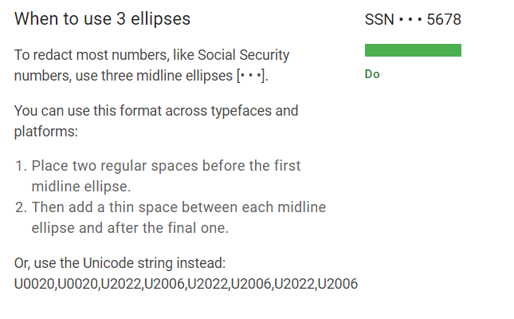
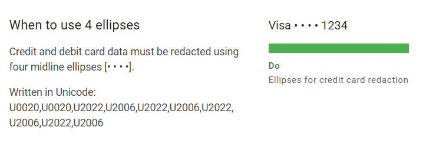
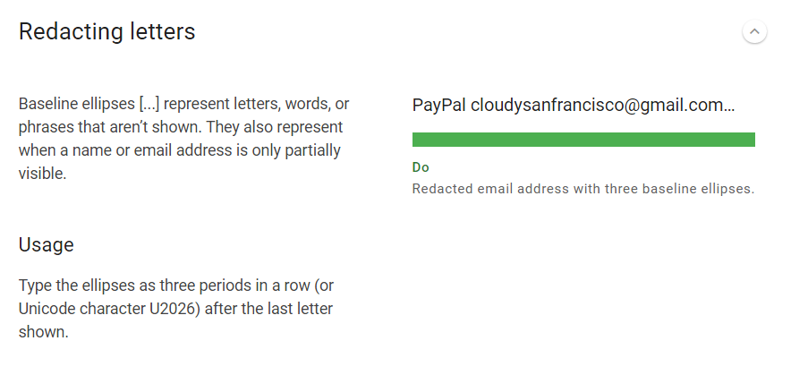

# Data Formats

 

## [Date and Time](https://material.io/design/communication/data-formats.html#date-and-time)

| Date or Time | When and How to Use | Example |
| -------- | -------- | -------- |
| Time | Within the current day, use uppercase AM or PM, without periods (or lowercase am/pm, if suitable for the locale). | 2:00 PM |
| 24-hour clock | Display the time without AM/PM. | 14:00 |
| Month, day, and year | Show the date with the year. If it’s within the current calendar year, don’t show the year. | January 14   14 January 2012 |
| Approximate time | Round down to the largest and most recent date or time. | In 5 minutes 3 days ago |
| Absolute time | When approximate time isn’t appropriate, display the specific date or time. | Today, 10:00 AM |

 

### Date and Time Ranges

| Range | When and How to Use | Example |
| ----- | ------------------- | ------- |
| Year | Date ranges are formatted based on whether the range covers the same year or the current year: <ul><li>Show the year on both the start and end</li><li>If both dates have the current year, show the year only on the end of the range</li></ul> | Dec 6, 2013–Jan 2, 2014   January 4–6, 2014 |
| AM/PM | Use a single AM or PM at the end of the range, if both times have the same AM/PM. | 8:00–10:30 AM |

 

### Time Zones

| Types of time zones | Description | Example |
| ----- | ------------------- | ------- |
| Single-digit hours | Remove the leading 0 for single-digit hours. | UTC+5:00 |
| Single time zones | Use two-letter time zones when referring to a single time zone. Remove the S (for Standard) or D (for Daylight). | Open 4–10 PM ET |
| Combination time zones | When specifying a date for a nationwide audience, include Standard or Daylight acronyms (such as EDT) to avoid confusion. Some U.S. states, such as Arizona, don't use daylight savings time. | The first game is on April 13, 2020 at 4 PM EDT. |

 

### When to show date and time

Depending on the context, show either date or time, or both date and time.

| Time period | When and how to use	| Example |
| ----------- | ------------------- | ------- |
| Future | Include time to a future day or date. | 10 Jan, 08:00 |
| Past | When referring to a past time, display both date and time. | Reminded Jan 5, 7:16 AM |
| Distant past | For events in the distant past, omit the time. | 3 Jan |
| Weekday | When referring to a day of the week, display the abbreviated day separated by a comma. | Mon, Jan 10, 8:00 AM |
| Duration | Show the duration of a recording, like audio or video, in the format H:MM:SS. Omit hours or seconds if they don’t apply.   Use the same format across the same context. A video labelled “3:15” referring to hours and minutes, should not use that time format later on that page to refer to minutes and seconds. | 0:30   1:01:05

 

### Abbreviations

Use abbreviations when space is limited.

| Unit of time | Description | Example |
| ------------ | ----------- | ------- |
| Month | Months can be abbreviated or numeric. | Jan 6 3/12/20 |
| Date | The US date format is month/day/year, but other countries use day/month/year. | If the date March 12, 2020 is written as 03/12/20, it could be interpreted to mean December 3, 2020 for different users. |
| Day | Abbreviate days of the week using the first letter of each day. | S for Sunday   M for Monday |
| Day and time | Abbreviated days of the week may be combined with a time. | Sun, 2:00 PM   Sun, 14:00 |
| Rounded numbers | You can use abbreviated numerical units, which remove the “:00,” for timestamps, labels on graphs, durations, and more. | 8 AM   2 hr 32 min ago |

 
 

## [Data Redaction](https://material.io/design/communication/data-formats.html#data-redaction)

Data redaction and truncation refers to how to represent truncated numbers and disguise sensitive data.

 

### Redacting numbers

Midline ellipses [• • •] are bulleted characters that partially hide sensitive data. They indicate when a number, such as a credit card or Social Security number, is not entirely visible.

 

 

 

### Redacting letters

 

