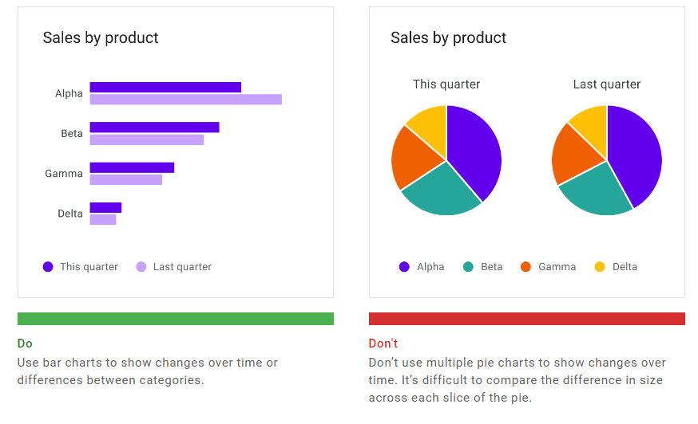
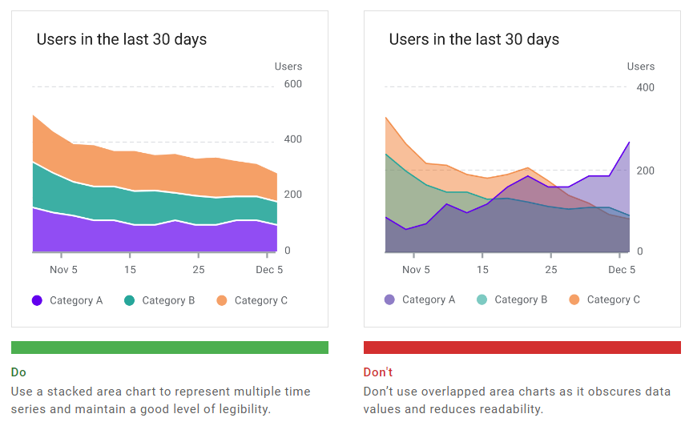

# [Data Visualization](https://material.io/design/communication/data-visualization.html#principles)

 

## [Principles](https://material.io/design/communication/data-visualization.html#principles)

 

Data visualization portrays dense and comple data of varying types and sizes in graphical form. The resulting visuals are designed to make it easy to compare data and use it to tell a story – both of which can help users in decision making.

* Prioritize data accuracy, clarity, and integrity, presenting information in a way that doesn’t distort it.
* Help users navigate data with context and affordances that emphasize exploration and comparison.
* Adapt visualizations for different device sizes, while anticipating user needs on data depth, complexity, and modality.

 
 

## [Types](https://material.io/design/communication/data-visualization.html#types)

### Change over time
Change over time charts show data over a period of time, such as trends or comparisons across multiple categories.

 

### Category comparison
Category comparison charts compare data between multiple distinct categories.

 

### Ranking
Ranking charts show an item's position on an ordered list.

 

### Part-to-whole
Part-to-whole charts show how partial elements add up to a total.

 

### Correlation
Correlation charts show correlation between two or more variables.

 

### Distribution
Distribution charts show how often each values occur in a dataset.

 

### Flow
Flow charts show movement of data between multiple states.

 

### Relationship
Relationship charts show how multiple items relate to one other.

 
 

## [Selecting charts](https://material.io/design/communication/data-visualization.html#selecting-charts)

### Showing change over time
Change over time can be expressed using a time series chart, which is a chart that represents data points in chronological order. Charts that express change over time include: line charts, bar charts, and area charts.

 

| Type of chart | Usage | Baseline value (starting value on y-axis) | Quantity of time series | Data type |
| ------------- | ----- | ----------------------------------------- | ----------------------- | --------- |
| Line chart | To express minor variations in data | Any value | Any time series (works well for charts with 8 or more time series) | Continuous |
| Bar chart | To express larger variations in data, how individual data points relate to a whole, comparisons, and ranking | Zero | 4 or fewer | Discrete or categorical |
| Area chart | To summarize relationships between datasets, how individual data points relate to a whole | Zero (when there’s more than one series) | 8 or fewer | Continuous |

 

### Bar and Pie Charts
Both bar charts and pie charts can be used to show proportion, which expresses a partial value in comparison to a total value.

* Bar charts express quantities through a bar’s length, using a common baseline
* Pie charts express portions of a whole, using arcs or angles within a circle

Bar charts, line charts, and stacked area charts are more effective at showing change over time than pie charts. Because all three of these charts share the same baseline of possible values, it’s easier to compare value differences based on bar length.

 

### Area charts

Area charts come in several varieties, including stacked area charts and overlapped area charts:

* Stacked area charts show multiple time series (over the same time period) stacked on top of one another
* Overlapped area charts show multiple time series (over the same time period) overlapping one another

 
 

## [Style](https://material.io/design/communication/data-visualization.html#style)

Area charts come in several varieties, including stacked area charts and overlapped area charts:

* Stacked area charts show multiple time series (over the same time period) stacked on top of one another
* Overlapped area charts show multiple time series (over the same time period) overlapping one another

